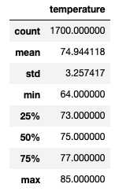
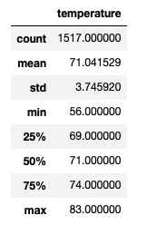

# Surfs_up
## Overview
The purpose of this analysis is to analyze climate data in Oahu to determine how successful the surf and ice cream shops will be.
## Results
   - June: 
   -      
   - December: 
   - 
   - The average temperature in Oahu during the month of June is 74.9 degrees whereas the average temperature in December is 71 degrees.  
   - The minimum temperature recorded in June is 64 degrees and the minimum temperature recorded in December is 56 degrees. 
   - The maximum temperature recorded in June is 85 degrees and the maximum temperature recorded in December is 83 degrees.

## Summary
There is a high-level summary of the results and there are two additional queries to perform to gather more weather data for June and December.
